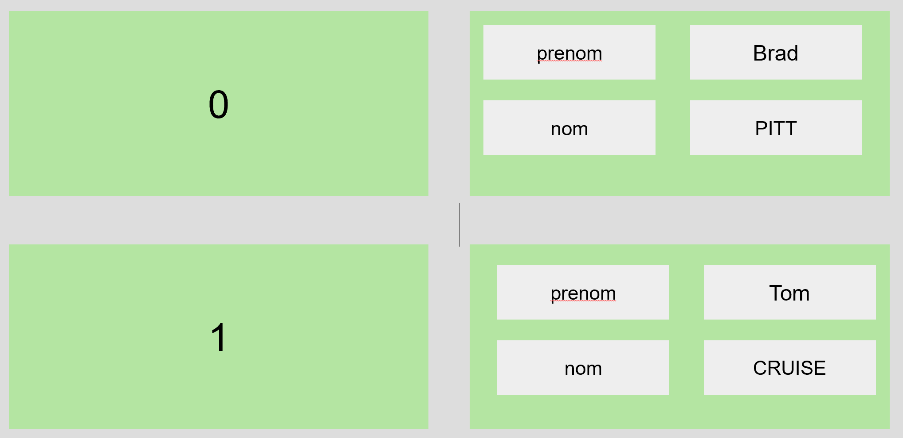

# TP 02 - les tableaux


Question 1

```php
<?php
            $tableau = [
                0 =>[ "prenom"=>"Brad","nom"=>"PITT"],
                1 =>[ "prenom"=>"Tom","nom"=>"CRUISE"]
            ];
?>
<table> 
<?php foreach( $tableau as $indice => $tab2 ): ?>
<tr>
    <td><?=$indice?></td>
    <td><?=$tab2["prenom"]?></td>
    <td><?=$tab2["nom"]?></td>
</tr>
<?php endforeach; ?>
</table> 
```

Question 2
```php
 <?php
//Tableau ayant pour valeurs les entiers de 0 à 63
$tab = range(0, 63);

//Tableau ayant pour valeurs les décimaux de 0 à 6.3
//Tableau dont les clés sont X et les valeurs sin(X)
foreach ($tab as $ind => $val) {
    $val = (string) ($val / 10);
    $tabsin[$val] = sin($val);
}
?>
<table border="1" width="50%">
    <thead>

        <tr>
            <th>X</th>
            <th>sin(X)</th>
        </tr>
    </thead>
    <tbody>
        <?php foreach ($tabsin as $cle => $val): ?>
            <tr>
                <td><?=$cle?></td>
                <td><?=$val?></td>
            </tr>
        <?php endforeach; ?>
    </tbody>
</table>
?>
```
