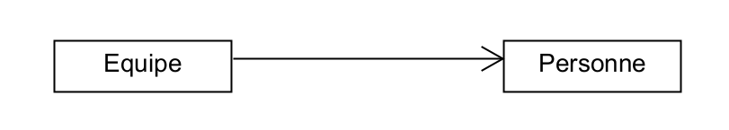
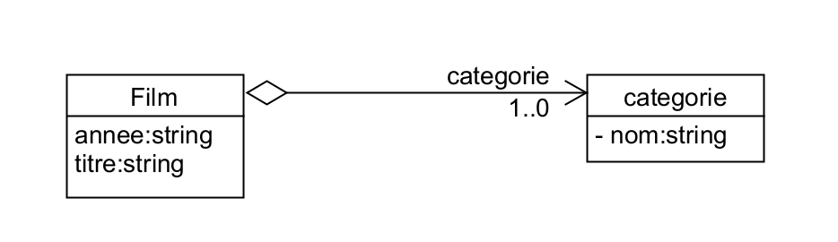

#  Association / Aggregation / Composition
Les relations entre les classes
  
Quand on commence la programmation orienté objet  
Il est difficile de choisir en une associtaion (Association / Aggregation / Composition) ou un héritage.

## La composition

La relation de composition modélise une relation d’inclusion entre les instances de deux classes.  
  
Une cheval ne peut pas "fonctionner" sans tête

## L'agrégation
Une agrégation est un type spécial d'association dans laquelle les objets sont assemblés ou configurés ensemble pour créer un objet plus complexe. Une agrégation décrit un groupe d'objets et comment vous interagissez avec eux.
On parle alors sous partie.

   

## L'association
Une relation d'association entre deux classes.
On peut dire que une classe possède un ou des objets.
  

## les cardinalités et le nom

L'attribut <code>categorie</code> apparait sur la flèche.
     
il n'apparait pas dans la liste des attributs.    
Il est possible d'ecrire les cardinalités.    
En fonction des cardinalité on saura si c'est un objet ou un tableau d'objet.
