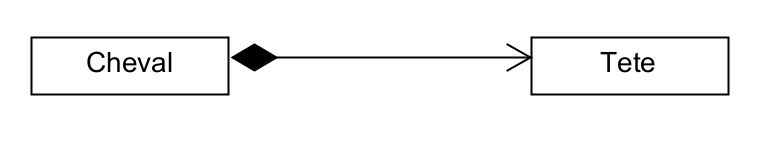
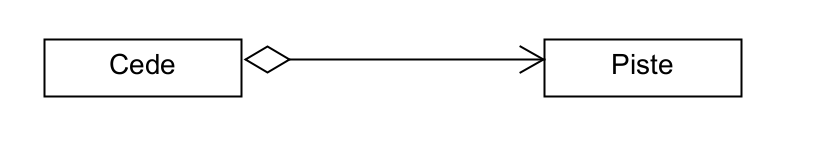
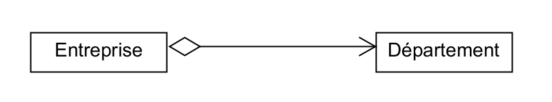

#  Association / Aggregation / Composition

## La composition

La relation de composition modélise une relation d’inclusion entre les instances de deux classes.
Une cheval ne peut pas "fonctionner" sans tête

## L'agrégation
Une agrégation est un type spécial d'association dans laquelle les objets sont assemblés ou configurés ensemble pour créer un objet plus complexe. Une agrégation décrit un groupe d'objets et comment vous interagissez avec eux.
On parle alors sous partie.

   

## L'assotiation
Une relation d'association entre deux classes.
On peut dire que une classe possède un ou des objets.

