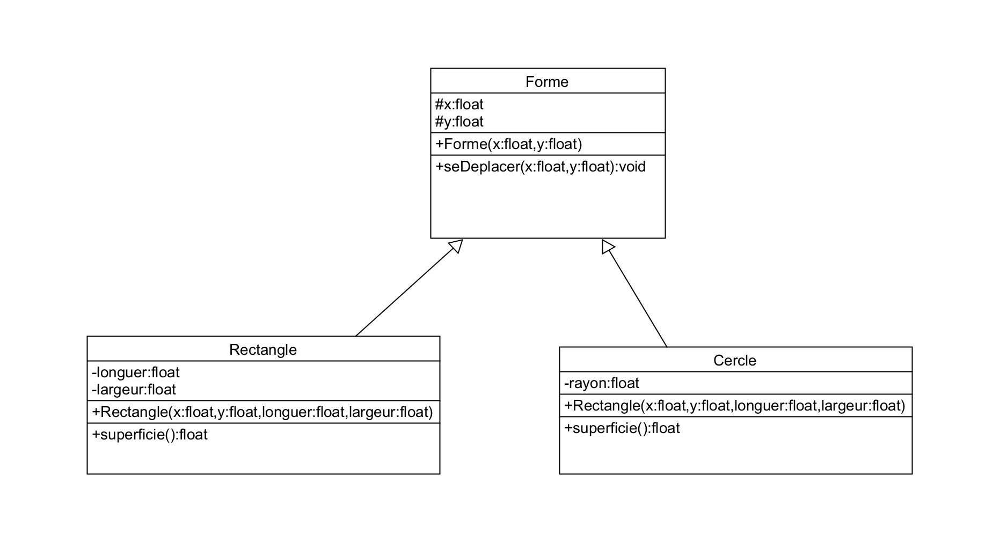

# Mise en place de l'héritage

Pour solutionner une problèmatique.  
La code de la fonction <code>seDeplacer()</code> se trouve identique dans 2 classes.  
 

----------

La solution créer une classe Mère  
avec les attribute x et y
et la méthode se déplacer

