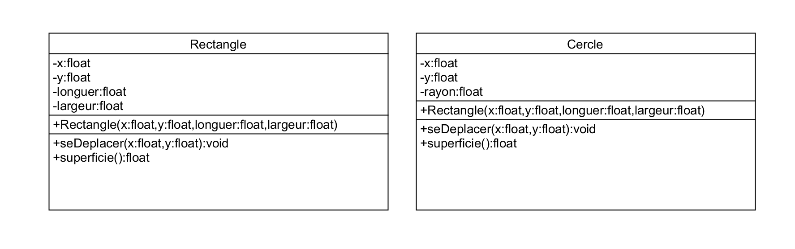

# Mise en place de l'héritage
Le mot héritage est souvent utilisé dans un cadre de sucession ou de génétique. Il implique que les descendants possèdent une partie des gènes ou des biens de leurs ascendants.  
  
**Et en programmation orientée objet ?**
  
Pour les néophytes, définissons ce qu'est l'héritage en POO (Programmation orientée objet) :  
  
Pour faire simple, c'est un mécanisme qui va permetttre, comme son nom l'indique, de transmettre toutes les méthodes et les attributs d'une classe dite "mère" vers une autre dite "fille" et ainsi de suite.  

----------
  
:warning: Pour solutionner une problèmatique.  
La code de la fonction <code>seDeplacer()</code> se trouve identique dans 2 classes.  
 


----------


La solution créer une classe Mère  
avec les attribute x et y
et la méthode se déplacer


# Forme.php
```php
<?php
namespace Classes;

class Forme{
    protected ?Float $x =null;
    protected ?Float $y=null;
    
    public function __construct(?Float $x,?Float $y){
            $this->x=$x;
            $this->y=$y;
    }

    public function getX ():?Float{
        return $this->x;
    }    
    public function setX (Float $x):void{
        $this->x=$x;
    } 
     public function getY ():?Float{
        return $this->y;
    }    
    public function setY (Float $y):void{
        $this->y=$y;
    } 
}
```

<code> parent::__construct($x,$y);</code> On appelle le constructeur de la classe mère

# Rectangle.php
```php
<?php
namespace Classes;
use Classes\Forme;
class Rectangle extends Forme{

    private ?Float $longueur = null;
    private ?Float $largeur = null;

    public function __construct(Float $x,Float $y,Float $longueur,Float $largeur){
            parent::__construct($x,$y);
            $this->longueur=$longueur;
            $this->largeur=$largeur;
    }
    public function getLongueur ():?Float{
        return $this->longueur;
    }    
    public function setlongueur (Float $longueur):void{
        $this->longueur=$longueur;
    } 
    public function getLargeur ():?Float{
        return $this->largeur;
    }    
    public function setLargeur (Float $largeur):void{
        $this->largeur=$largeur;
    } 
}

```
