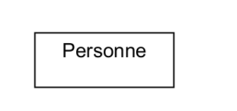
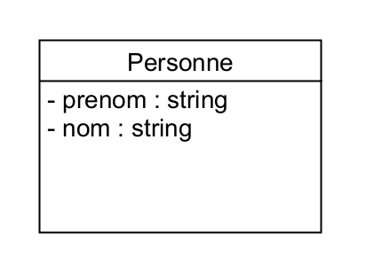
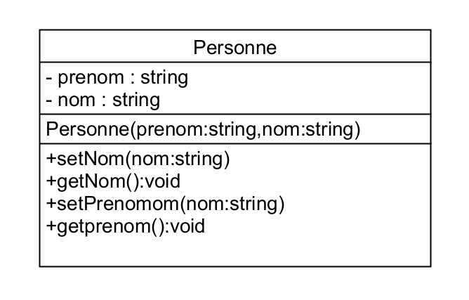

# 04 - Ma première classe

## un objet sans Classe !
Le PHP étant un language _"permissif"_   
tout est possible ...  

Oui c'est possible avec <code>stdClass</code>  
```php
$presonne = new stdClass();
$personne->prenom="Brad";
$personne->nom="PITT";
```

## Présentation de UMLET
https://www.umlet.com/

## Création d'une classe
Diagramme UML de personne

Version UML simplifiée :
  


Version UML avec les attributs :
  


<code>+</code> public  
<code>-</code> private  
<code>#</code> protected  

Version complète UML :
  


le contructeur :
```php
<?php
namespace Classes;

class Personne{
    private String $nom;
    private String $prenom;
    public function __construct(String $nom,String $prenom){
            $this->nom=$nom;
            $this->prenom=$prenom;
    }
}
```


avec <code>?</code>
```php
<?php
namespace Classes;

class Personne{
    private ?String $nom =null;
    private ?String $prenom=null;
    
    public function __construct(?String $nom,?String $prenom){
            $this->nom=$nom;
            $this->prenom=$prenom;
    }
    public function getNom ():?String{
        return $this->nom;
    }    
    public function setNom (String $nom):void{
        $this->nom=$nom;
    } 
        public function getPrenom ():?String{
        return $this->prenom;
    }    
    public function setPrenom (String $prenom):void{
        $this->prenom=$prenom;
    } 
}


```

Ajouts des methodes

```php
<?php
namespace Classes;

class Personne{
    private ?String $nom =null;
    private ?String $prenom=null;
    
    public function __construct(?String $nom,?String $prenom){
            $this->nom=$nom;
            $this->prenom=$prenom;
    }
    public function getNom ():?String{
        return $this->nom;
    }    
    public function setNom (String $nom):void{
        $this->nom=$nom;
    } 
        public function getPrenom ():?String{
        return $this->prenom;
    }    
    public function setPrenom (String $prenom):void{
        $this->prenom=$prenom;
    } 
    public function getFullname():String{
        return $this->prenom." ".$this->nom;
    }
}


```


Mise en place de plusieurs constructeurs
```php
public function __construct(?String $nom='',?String $prenom=''){
            $this->nom=$nom;
            $this->prenom=$prenom;
    }
```

**Je teste**
```php
<?php	

require_once(VENDOR_ROOT.'Personne.php');
 $personne = new Personne('DOE','John');
 $personne = new Personne('DOE 2');
```

# lister les attributs de la classe ?
```php
 get_object_vars($this) ; 
```

```php
public function getListeAttributes():array{
        return get_object_vars($this) ;   
    }
```


# Dernière étape : Mise en place de l'ID
```php
<?php
namespace Classes;

use Classes\DB;

class Personne{
    private ?Int $id =null;
    private ?String $nom =null;
    private ?String $prenom=null;
    
    public function __construct(?String $nom='',?String $prenom='',?Int $id=0){
            $this->nom=$nom;
            $this->prenom=$prenom;
            $this->id=$id;
    }
    public function getId ():?String{
        return $this->id;
    }    
    public function setId (String $id):void{
        $this->id=$id;
    } 
    public function getNom ():?String{
        return $this->nom;
    }    
    public function setNom (String $nom):void{
        $this->nom=$nom;
    } 
        public function getPrenom ():?String{
        return $this->prenom;
    }    
    public function setPrenom (String $prenom):void{
        $this->prenom=$prenom;
    } 
    public function getFullname():String{
        return $this->prenom." ".$this->nom;
    }
   
    
}
```