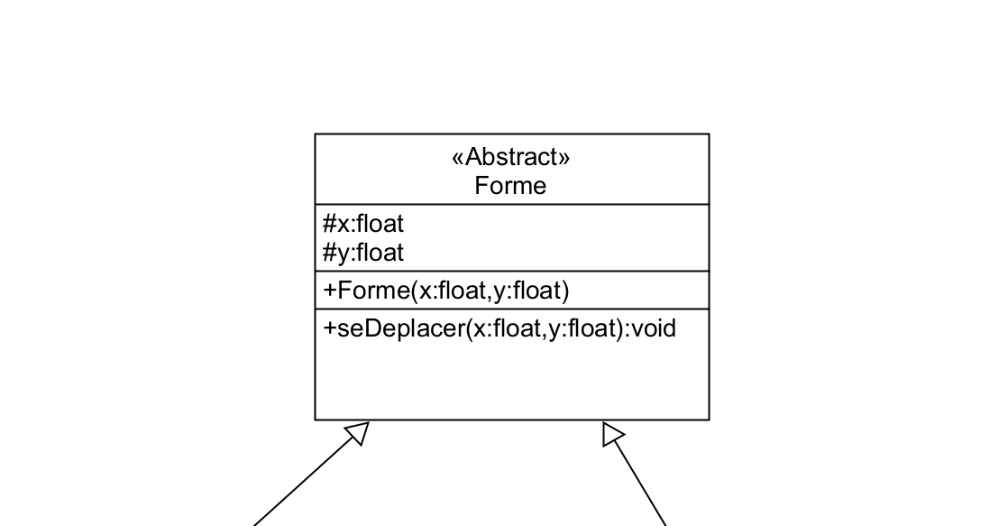

# Une classe Abstraite
PHP a des classes, méthodes et propriétés abstraites. Les classes définies comme abstraites ne peuvent pas être instanciées, et toute classe contenant au moins une méthode abstraite doit elle-aussi être abstraite. Les méthodes définies comme abstraites se contentent de déclarer la signature de la méthode et d'indiquer si elle est publique ou protégée ; elles ne peuvent pas définir l'implémentation. Les propriétés définies comme abstraites peuvent déclarer une exigence pour le comportement de get ou de set, et peuvent fournir une implémentation pour l'une de ces opérations, mais pas les deux.  

Lors de l'héritage d'une classe abstraite, toutes les méthodes marquées comme abstraites dans la déclaration de la classe parente doivent être définies par la classe enfant et suivre les règles habituelles d'héritage et de compatibilité de signature.  
  
<code>abstract</code> devant <code>class</code> permet de définir une classe abstraite.

Il n'est pas possible d'instancier une classe abstraite.

Nous décidons de mettre Forme en classe abstraite.  
Il n'est plus possible de créer des objets de type <code>Forme</code>
Il n'est possible d'utiliser Forme que par héritage.



# Forme.php
```php
<?php
abstract class Forme{
\\...
}
```
:warning: Ceci n'est plus possible !

```php
$forme1 = new Forme(1,1);
```

# Une méthode abstraite


Une méthode abstraite c'est **un contrat**
que l'on lance à la classe enfant : Obligation d'avoir cette méthode

```php
<?php
namespace Classes;

abstract class Forme{
    protected ?Float $x =null;
    protected ?Float $y=null;
    
    public function __construct(?Float $x,?Float $y){
            $this->x=$x;
            $this->y=$y;
    }
    abstract protected function superficie():Float;
    public function getX ():?Float{
        return $this->x;
    }    
    public function setX (Float $x):void{
        $this->x=$x;
    } 
     public function getY ():?Float{
        return $this->y;
    }    
    public function setY (Float $y):void{
        $this->y=$y;
    } 
}

```