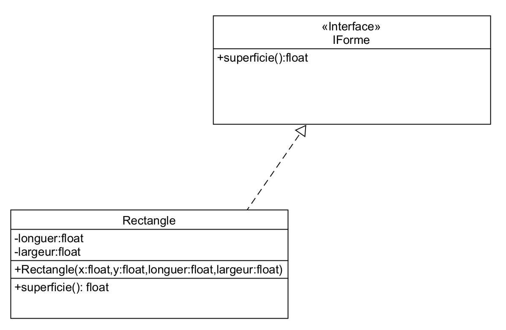

# 09 Interface

**Établissez des contrats avec les interfaces**

En programmation orientée objet, une interface est un ensemble de signatures de méthodes publiques d'un objet.

Afin de spécifier des comportements communs attendus entre différentes classes appartenant à des domaines différents.



Implémenter un interface c'est un signer un contrat  
C'est a dire une obligation d'impleter les methodes renseigner l'interface  

```php
interface IForme
{
   public function superfici(): Float;
}

class Rectangle implements IForme{

}
```

**Il est possible d'implémenter plusieurs Interfaces**
