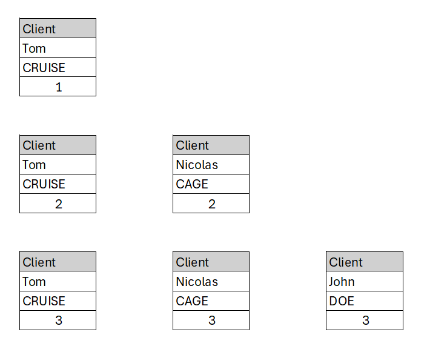

# Comment utiliser static

Qu'est-ce qu'une méthode statique ?
Qu'est-qu'un attribut statique ?

Le fait de déclarer des propriétés ou des méthodes comme statiques vous permet d'y accéder sans avoir besoin d'instancier la classe. Celles-ci peuvent alors être accédées statiquement depuis une instance d'objet.
  
  
Comme les méthodes statiques peuvent être appelées sans qu'une instance d'objet n'ait été créée, la pseudo-variable $this n'est pas disponible dans les méthodes déclarées comme statiques.

**Client.php**
```php
<?php
namespace Classes;
class Client
{
   
    private ?String $nom = null;
    private ?String $prenom = null;
    private static ?Int  $indice = 0 ;

    public function __construct( ?String $prenom = '',?String $nom = '')
    {
        $this->nom = $nom;
        $this->prenom = $prenom;
        self::$indice = self::$indice+1;
    }
    public static function getIndice(){
        return self::$indice;
    }
}
```

```php
<?php	
require_once('./config/config.php');
require_once(VENDOR_ROOT.'/autoload.php');

use Classes\Client;
$client1 = new Client('Tom','CRUISE');
$client2 = new Client('Nicolas','CAGE');
$client3 = new Client('John','DOE');
var_dump($client1->getIndice());
```

